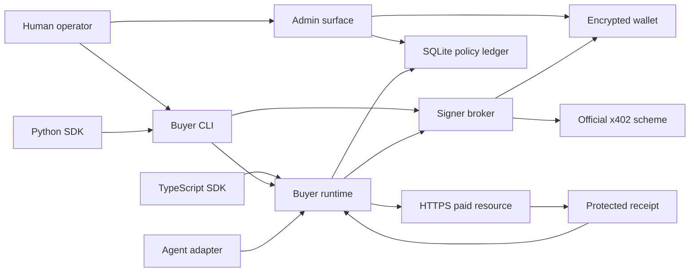

# Buyer Runtime, CLI, and SDK threat model

## Executive summary

Buyer Core concentrates local wallet, policy, budget, x402 authorization, and receipt decisions in
one private package. The highest-risk areas are decrypted signer lifetime, malicious or copied IPC
capabilities, cross-process budget races, paid-request ambiguity, local-state tampering, and the
explicit native SQLite build, secret-bearing CLI setup/unlock input, a stored short-lived session
descriptor, and the Python subprocess boundary. The implementation narrows those risks with encrypted standard
keystores, an owner-only expiring signer broker with no generic signing method, an immutable
human-reviewed session envelope, transactional maximum reservations, no paid retries or redirects,
and receipt-before-result release. Under the trusted single-user-host and dedicated low-balance
wallet assumptions below, no unresolved critical or high repository-local threat is known; host
account compromise and public release remain outside this private v1 decision.

## Scope and assumptions

In scope: `packages/buyer-core`, `apps/buyer-cli`, `clients/typescript`, `clients/python`, shared
adapter vectors, the explicit native-dependency CI step, dependency pin/license/SBOM traversal,
ADR-048/ADR-049, and the internal recovery guides. The server, provider, facilitator implementation,
MCP/proxy, browser custody, deployment, package publication, and any live USDC request are out of
scope.

Assumptions:

- one human owns a trusted single-user macOS/Linux account and directly enters the passphrase;
- the wallet is dedicated to paid API calls, has a balance no greater than its daily budget, and is
  not a treasury, deployer, governance, or personal-savings wallet;
- adapters and model-directed inputs may be malicious at the Buyer Runtime API/IPC boundary, but an
  attacker does not already have arbitrary same-UID filesystem access, process-memory access,
  debugger rights, or control of the host/compiler;
- the configured HTTPS origin, Base USDC address, approved recipients, and model aliases were
  reviewed by the human before unlock;
- official x402 and EVM packages behave according to their pinned contracts.
- Python executes the reviewed first-party CLI by an operator-controlled absolute or PATH-resolved
  command and does not run inside a hostile shared account.

Open questions that would materially change risk are shared/multi-user-host support, a public npm
release, hardware/external signers, and adapters that execute arbitrary same-UID native code. Each
requires a new threat review; none is silently covered by this model.

## System model

### Primary components

- Human/operator admin surface: wallet create/import, backup/restore/rotation, exact policy increase,
  wallet binding, and broker unlock (`src/vault.ts`, `src/ledger.ts`, `src/admin.ts`).
- Adapter-facing runtime: canonical POST lifecycle, safe headers, outcome classification, receipt
  recovery, and result release (`src/runtime.ts`, `src/index.ts`).
- Signer broker: owner-only Unix IPC, capability/session expiry, independent policy/reservation
  validation, and official `upto` payload creation (`src/broker.ts`).
- Durable local state: encrypted ethers keystore plus strict SQLite policy/operation ledger
  (`src/filesystem.ts`, `src/vault.ts`, `src/ledger.ts`).
- External boundaries: configured HTTPS x402 resource and protected receipt route through injected
  or global Fetch; official x402/ethers/viem/native SQLite dependencies (`package.json`).
- Build/CI only: pnpm exact lockfile, disabled global lifecycle scripts, explicit SQLite rebuild,
  tests, license traversal, and SBOM generation (`../../.github/workflows/ci.yml`,
  `../../scripts/dependency-graph.mjs`).
- Human-facing CLI: transactional setup, direct no-echo secret input, broker-worker lifecycle,
  status/policy/funding/discovery/chat/receipt commands, and redacted diagnostics
  (`../../apps/buyer-cli`).
- TypeScript SDK: high-level allowlisted paid methods and strict bounded discovery; session
  capability reading remains internal to the implementation (`../../clients/typescript`).
- Python SDK: standard-library, no-shell subprocess adapter over the CLI's bounded v1 JSON bridge;
  it does not implement payment or signing (`../../clients/python`).

### Data flows and trust boundaries

- Human → admin API: passphrase, import secret, encrypted backup path, and reviewed policy cross an
  in-process direct-command boundary. Validation is fail closed; stable results expose only address
  and encrypted paths.
- Adapter → runtime: URL, model, canonical JSON, idempotency key, and a tiny header allowlist cross
  an untrusted API boundary. Exact origin/model/output-token checks run before network or signing.
- Runtime → HTTPS resource: unpaid JSON and then one identical paid JSON plus official payment
  header cross TLS. Fetch redirect mode is `error`; caller credentials and payment headers are not
  accepted for forwarding.
- Runtime → SQLite: request/challenge hashes and integer maximum reservations cross a local
  cross-process boundary protected by strict schema, WAL, full sync, safe integers, foreign keys,
  and `BEGIN IMMEDIATE`.
- Runtime → signer broker: exact validated challenge and reservation identity cross an owner-only
  Unix socket with a 256-bit capability, agent/session binding, message-size limit, and expiry.
- Broker → official x402 scheme: the decrypted signer and exact requirement stay inside the broker;
  only the official payment payload returns.
- Resource → receipt verifier: protected receipt JSON and settlement evidence cross HTTPS and strict
  schema/identity/payer/network/amount/transaction validation before result release.
- Human → CLI → broker worker: import secret/passphrase crosses a no-echo terminal boundary and then
  one inherited Node IPC channel. It is absent from argv, environment, output, diagnostics, and the
  persistent session descriptor.
- TypeScript SDK → profile/broker: the SDK reads the owner-only descriptor internally and sends its
  capability only to the exact owner-only Unix socket. The normal SDK export cannot read it.
- Python → CLI bridge: bounded JSON crosses stdin/stdout through `subprocess.run(shell=False)`; only
  allowlisted actions/endpoints are accepted and wallet secrets are not part of the protocol.

#### Diagram

## Assets and security objectives

| Asset                                 | Why it matters                                                             | Security objective (C/I/A) |
| ------------------------------------- | -------------------------------------------------------------------------- | -------------------------- |
| Wallet private key and passphrase     | Theft permits authorization outside the application                        | C/I                        |
| Broker capability and signer lifetime | Copied live authority can spend inside the envelope                        | C/I/A                      |
| Human-reviewed policy                 | A widened origin/asset/recipient/model/cap changes financial authority     | I                          |
| Reservation/spend ledger              | Deletion or race can permit budget overspend                               | I/A                        |
| Idempotency and challenge hashes      | Mismatch can duplicate work or authorize a changed request                 | I                          |
| Receipt token and durable receipt     | Token exposes protected proof; false receipt can release unverified output | C/I                        |
| Provider result                       | Must not be released before settlement and receipt durability              | C/I/A                      |
| Build graph/native binary             | Compromise executes with wallet-process authority                          | C/I/A                      |
| CLI/bridge output and diagnostics     | Secret or capability leakage creates replayable local signing authority    | C/I                        |

## Attacker model

### Capabilities

- controls model-directed URL/body/header/idempotency input passed by an adapter;
- can present malicious x402 challenges from the configured remote origin;
- can connect to a discoverable Unix socket and may copy a legitimately delegated capability;
- can race multiple adapter processes and crash one at reserve/sign/authorize/commit boundaries;
- can provide corrupt backups, symlinks, unsafe paths, oversized responses, malformed headers, and
  conflicting settlement/receipt data;
- may compromise a dependency or build artifact before pin/SBOM/review controls detect it.
- can pass malformed/oversized JSON, arbitrary endpoints, hostile profile paths, and shell-like
  strings to CLI/SDK surfaces and can attempt to induce secret echo through failures.

### Non-capabilities

- does not know the human passphrase or import secret;
- cannot already read/write arbitrary files or memory under the owner account, attach a debugger,
  replace the running broker, control TLS/DNS certificates, or control the compiler/CI host;
- cannot change the broker's in-memory reviewed policy envelope after unlock;
- cannot invoke an unexported generic signing method because no such IPC action exists.

## Entry points and attack surfaces

| Surface                | How reached              | Trust boundary            | Notes                                                         | Evidence                                         |
| ---------------------- | ------------------------ | ------------------------- | ------------------------------------------------------------- | ------------------------------------------------ |
| `BuyerRuntime.execute` | Adapter API              | Adapter → runtime         | Canonical JSON, exact model, safe headers, output cap         | `src/runtime.ts` / `execute`                     |
| `PAYMENT-REQUIRED`     | Remote 402 header        | HTTPS resource → policy   | Official decode/schema plus exact policy validation           | `src/policy.ts` / `validatePaymentRequirement`   |
| Signer socket          | Local Unix IPC           | Adapter → broker          | Capability, identity, expiry, 256 KiB limit, three actions    | `src/broker.ts` / `processLine`                  |
| Wallet/admin methods   | Direct operator code     | Human → custody           | Passphrase required for sensitive mutation                    | `src/vault.ts` / `WalletVault`                   |
| SQLite ledger          | Multiple local processes | Runtime → durable state   | Strict integer schema and immediate transactions              | `src/ledger.ts` / `LocalSpendLedger`             |
| Receipt route          | Read-only HTTPS GET      | Resource → verifier       | Token never returned to adapter; bounded strict verification  | `src/runtime.ts` / `retrieveReceipt`             |
| Native build           | CI/local install         | Registry/source → runtime | One explicit exact-pinned build exception                     | `package.json`, `../../.github/workflows/ci.yml` |
| CLI terminal/admin     | Direct human command     | Human → CLI → runtime     | No-echo secrets; transactional setup; widening authenticates  | `../../apps/buyer-cli/src/main.ts`               |
| Session descriptor     | SDK/CLI local profile    | Filesystem → broker       | Owner-only strict schema; normal SDK cannot export helper     | `../../clients/typescript/src/profile.ts`        |
| Python JSON bridge     | Python subprocess        | Python → CLI → runtime    | 1 MiB input, versioned envelope, no shell, endpoint allowlist | `../../clients/python`, CLI `_bridge`            |
| Diagnostic bundle      | Direct human command     | Runtime → support file    | Owner-only atomic write and explicit redaction                | CLI `doctor`                                     |

## Top abuse paths

1. An adapter submits a challenge for a wrong recipient or larger amount → runtime and broker both
   compare it to policy → authorization fails before official signing.
2. A local peer copies a broker capability → tries another agent/session or generic signing action →
   identity/action validation rejects it; same-session calls still consume transactional budgets.
3. Two processes race the final budget units → both reserve with `BEGIN IMMEDIATE` → one commits and
   the other receives `AuthorizationAboveLocalCap`.
4. The process crashes after a signature is claimed → the unreturned `signing` state expires safely;
   a crash after authorization remains charged against the budget and requires recovery/review.
5. A paid POST loses its response → runtime marks settlement unknown and does not POST again → a
   same-key unpaid recovery request/receipt GET can recover without new signing.
6. A resource redirects the paid POST or protected receipt → Fetch rejects the redirect → payment
   payload or receipt token is not sent to a second origin.
7. A server returns a result with a forged/over-cap receipt → strict payer/network/model/identity/
   amount/transaction checks fail → body remains withheld and reservation becomes unknown.
8. An agent requests a policy increase and reuses an old capability → one-use authentication is
   bound to the exact policy hash, and the running broker rejects anything beyond its old envelope.
9. An attacker supplies a symlink/corrupt backup → no-follow, ownership/mode, decrypt, address, and
   atomic-replace checks fail before the active encrypted wallet changes.
10. A compromised native dependency runs during build → exact pin, disabled default scripts,
    explicit rebuild, license traversal, SBOM, and review reduce but do not eliminate compromise.
11. An agent injects shell syntax or an arbitrary paid URL through Python → the SDK uses an argument
    array with `shell=False`, and the CLI bridge accepts only five exact endpoint paths.
12. A failure attempts to leak a passphrase/capability through JSON or diagnostics → secrets never
    enter argv/environment/the bridge protocol, normal SDK exports cannot read the descriptor, and
    redaction tests reject canaries in output and doctor bundles.

## Threat model table

| Threat ID | Threat source                          | Prerequisites                                                    | Threat action                                                                     | Impact                                 | Impacted assets                | Existing controls (evidence)                                                                                                                        | Gaps                                                                                          | Recommended mitigations                                                                        | Detection ideas                                    | Likelihood | Impact severity | Priority |
| --------- | -------------------------------------- | ---------------------------------------------------------------- | --------------------------------------------------------------------------------- | -------------------------------------- | ------------------------------ | --------------------------------------------------------------------------------------------------------------------------------------------------- | --------------------------------------------------------------------------------------------- | ---------------------------------------------------------------------------------------------- | -------------------------------------------------- | ---------- | --------------- | -------- |
| TM-001    | Malicious remote/resource input        | Configured origin returns attacker-controlled challenge          | Change network, asset, recipient, scheme, model, timeout, facilitator, or maximum | Unauthorized payment                   | Policy, wallet                 | Dual runtime/broker validation and official schemas (`src/policy.ts`, `src/broker.ts`)                                                              | A compromised approved origin can still cause allowed payments                                | Keep per-call/day caps low; pin reviewed origin/recipients                                     | Count safe rejection codes without payloads        | low        | high            | medium   |
| TM-002    | Copied local capability                | Peer obtains a live delegated capability                         | Spend repeatedly or request generic signatures                                    | Budget loss or key misuse              | Capability, wallet             | Three-action IPC, identity/session binding, immutable envelope, transaction claim, expiry (`src/broker.ts`)                                         | A copied capability can spend inside remaining delegation                                     | Keep delegations small; lock after use; future OS-backed peer credentials                      | Broker rejection/expiry counters in future adapter | medium     | medium          | medium   |
| TM-003    | Unsafe path or corrupt state           | Attacker controls backup/path or can corrupt owner-visible files | Redirect, replace, or destroy wallet/ledger                                       | Key loss or availability loss          | Wallet, ledger                 | No-follow reads, realpath containment, owner/mode checks, atomic fsync writes, last-good copy (`src/filesystem.ts`, `src/vault.ts`)                 | Full same-UID host compromise is not prevented                                                | Keep offline encrypted backup; evaluate keychain/external signer before shared-host support    | Restore drill and state-integrity failure counters | low        | high            | medium   |
| TM-004    | Concurrent/crashing adapters           | Multiple processes share budget or crash at boundaries           | Overspend or release ambiguous authorization                                      | Financial loss                         | Ledger                         | Strict bigint-equivalent integers, WAL/full sync, immediate transactions, conservative states (`src/ledger.ts`)                                     | Host disk failure remains possible                                                            | Preserve periodic encrypted/offline state backup if product needs ledger portability           | Inspect retained `authorized`/`unknown` operations | low        | high            | medium   |
| TM-005    | Redirect/SSRF source                   | Approved origin or receipt response issues redirect              | Exfiltrate payment payload/token to another origin                                | Payment or receipt compromise          | Payment payload, receipt token | Exact HTTPS origin/resource, fixed receipt URL, `redirect: error`, header allowlist (`src/runtime.ts`)                                              | Compromised TLS endpoint remains trusted within policy                                        | Future optional certificate/public-key pin only if operationally sustainable                   | Safe redirect/network error classification         | low        | high            | medium   |
| TM-006    | Network/provider/facilitator ambiguity | Paid POST or settlement response is lost                         | Blindly retry and double charge/work                                              | Financial loss                         | Idempotency, spend             | One paid POST, `unknown` retention, same-key recovery, receipt-only retry (`src/runtime.ts`, `src/ledger.ts`)                                       | CLI has same-key receipt lookup but not an unknown-operation listing                          | Add a bounded unknown-operation inspection command before publication                          | Count unknown age and same-key recovery            | low        | high            | medium   |
| TM-007    | Forged successful response             | Resource returns body with missing/conflicting evidence          | Release unverified result or under-account spend                                  | Integrity and accounting failure       | Result, receipt, ledger        | Result withheld; strict receipt and settlement match; actual ≤ maximum; local receipt lookup (`src/receipt.ts`, `src/runtime.ts`, CLI)              | Remote receipt availability can delay recovery                                                | Preserve bounded operator receipt inspection and recovery UX                                   | Receipt failure/recovery metrics without token     | low        | high            | medium   |
| TM-008    | Dependency/build compromise            | Registry, transitive package, or compiler is compromised         | Execute in wallet-capable process                                                 | Key theft and arbitrary spend          | Wallet, build                  | Exact lock, scripts disabled by default, one explicit native rebuild, SBOM/license/pin checks (`package.json`, CI)                                  | Native compilation is a privileged exception                                                  | Add provenance/vulnerability scan before any publication; consider prebuilt attestation        | Diff SBOM and native hashes per release            | low        | high            | medium   |
| TM-009    | Memory/process compromise              | Attacker gains same-process read/debug capability while unlocked | Read decrypted signer or passphrase remnants                                      | Wallet theft                           | Private key, passphrase        | Passphrase not retained in options; short broker lifetime; refs dropped on stop; dedicated wallet (`src/broker.ts`, `src/vault.ts`)                 | JavaScript cannot guarantee zeroization; same-account compromise is out of scope              | External/hardware signer for higher balances; never use treasury wallet                        | Unexpected broker lifetime/socket checks           | low        | high            | medium   |
| TM-010    | Confused-deputy policy change          | Agent obtains a stale or unrelated admin proof                   | Widen policy or wallet binding                                                    | Authority escalation                   | Policy, wallet binding         | One-use 60-second proof bound to wallet/exact hash; CLI locks then directly prompts for a fresh passphrase; broker stays pinned                     | CLI summary needs formal usability qualification before publication                           | Keep exact policy diff and clean-profile human review in release qualification                 | Audit policy hash transitions without secret data  | low        | high            | medium   |
| TM-011    | CLI/diagnostic secret disclosure       | Malformed input or failure reaches output/support path           | Echo import secret, passphrase, payment payload, receipt token, or capability     | Wallet or delegated-authority theft    | Wallet, capability, receipt    | No-echo direct input, IPC not argv/env, narrow result types, owner-only session, redacted doctor, secret-canary tests (`apps/buyer-cli`, SDK tests) | JavaScript strings cannot be reliably zeroized; same-UID process reading remains out of scope | Keep sessions short; avoid crash reporters; qualify every supported terminal before release    | Scan stdout/stderr/diagnostics with canaries       | low        | high            | medium   |
| TM-012    | Python/CLI command injection           | Model controls adapter inputs or profile/body strings            | Invoke a shell, arbitrary binary action, endpoint, or oversized bridge request    | Code execution or unauthorized payment | Host, wallet, policy           | Operator-controlled command vector, `shell=False`, 1 MiB bridge input, strict action/five-endpoint allowlist, 16 MiB Python response limit          | A malicious replacement binary earlier in PATH is equivalent to host compromise               | Recommend pinned/absolute executable path for automation; add signed provenance before release | Bridge rejection counts; artifact provenance       | low        | high            | medium   |

## Criticality calibration

- Critical: remotely reachable private-key extraction; generic signing without passphrase; or an
  unauthenticated path that authorizes outside every configured limit. Examples include an IPC
  `signTypedData` primitive, raw key in a result, or redirecting a paid payload with no origin check.
- High: repeatable budget bypass, wrong-recipient/asset authorization, silent paid retry, or
  result release without durable settlement/receipt. Examples include nontransactional session
  accounting, releasing `unknown` on TTL, or accepting actual settlement above signed maximum.
- Medium: loss bounded by a dedicated daily-cap wallet, local denial of service with encrypted
  backup recovery, native supply-chain compromise requiring a separate upstream failure, or a
  copied capability limited to its delegation/session.
- Low: malformed-input failures with no signing, metadata-only disclosure, or noisy local denial of
  service that lock/restart resolves without weakening financial state.

## Focus paths for security review

| Path                                          | Why it matters                                                   | Related Threat IDs             |
| --------------------------------------------- | ---------------------------------------------------------------- | ------------------------------ |
| `packages/buyer-core/src/broker.ts`           | Sole decrypted-signer and IPC authority                          | TM-001, TM-002, TM-009, TM-010 |
| `packages/buyer-core/src/ledger.ts`           | Cross-process budgets, crash states, migrations, policy changes  | TM-003, TM-004, TM-006, TM-010 |
| `packages/buyer-core/src/runtime.ts`          | Paid retry, redirect, result-release, and receipt-token boundary | TM-005, TM-006, TM-007         |
| `packages/buyer-core/src/vault.ts`            | Keystore KDF, backup, restore, and rotation                      | TM-003, TM-009, TM-010         |
| `packages/buyer-core/src/filesystem.ts`       | Symlink, ownership, atomic write, and fsync controls             | TM-003                         |
| `packages/buyer-core/src/policy.ts`           | Exact challenge and broker-envelope enforcement                  | TM-001, TM-010                 |
| `packages/buyer-core/src/receipt.ts`          | Durable settlement proof validation                              | TM-007                         |
| `packages/buyer-core/package.json`            | Public surface and privileged dependency set                     | TM-008, TM-009                 |
| `.github/workflows/ci.yml`                    | Native build and verification behavior                           | TM-008                         |
| `scripts/dependency-graph.mjs`                | License/SBOM production dependency reachability                  | TM-008                         |
| `apps/buyer-cli/src/main.ts`                  | Human secret input, policy UX, bridge allowlist, diagnostics     | TM-006, TM-010, TM-011, TM-012 |
| `apps/buyer-cli/src/broker-worker.ts`         | Passphrase handoff, session persistence, lock/expiry cleanup     | TM-002, TM-009, TM-011         |
| `clients/typescript/src/profile.ts`           | Stored bearer capability validation and permissions              | TM-002, TM-003, TM-011         |
| `clients/typescript/src/buyer.ts`             | High-level endpoint allowlist and non-secret result contract     | TM-005, TM-006, TM-007         |
| `clients/python/src/onchain_router/client.py` | No-shell bridge and cross-language contract                      | TM-011, TM-012                 |
| `scripts/check-buyer-packages.mjs`            | Private/public surface and pre-publication artifact checks       | TM-008, TM-011, TM-012         |

## Quality check

- All discovered admin, adapter, IPC, filesystem, SQLite, HTTPS, receipt, and build entry points are
  represented above.
- Every trust boundary appears in at least one abuse path and threat row.
- Runtime, CLI, TypeScript, and Python behavior is separated from tests and the CI-only native
  build exception.
- The user's private-GitHub/no-production clarification and solo-operator context are reflected in
  scope and assumptions.
- Shared-host, same-UID arbitrary code, Windows, hardware signers, and public publication remain
  explicit open questions rather than implied support.
